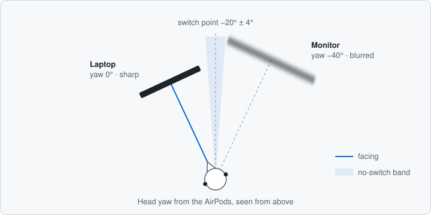

# Blink

A macOS menu bar app that blurs the screens you aren't looking at. It knows where you're
looking from the head tracking in your AirPods, so there's no camera involved.

It can also lock your Mac when you get up and walk away with your AirPods on.

<p align="center">
  
</p>

## Requirements

- A Mac with Apple silicon running macOS 14 or later (head tracking isn't available on
  Intel Macs)
- Headphones with head tracking:
  - AirPods (3rd generation and later)
  - AirPods Pro (any generation)
  - AirPods Max
  - Beats Fit Pro
- Two or more displays for the blur (the walk-away lock works with one)

## Install

There is no prebuilt release yet. Build it with the Xcode command line tools
(`xcode-select --install`):

```sh
git clone https://github.com/farukkavlak/blink.git
cd blink
scripts/build-app.sh --install   # builds, copies to ~/Applications, launches
```

On first launch macOS asks for **Motion & Fitness** access. That is how the app reads the
AirPods' head tracking. No other permission is needed.

## Use

Wear your AirPods and work normally. Blink watches which window you type into and learns
where each screen is from that. After a few minutes of typing on each screen, it switches
from a light haze to full blur. It keeps a separate layout for each combination of
displays, so a home desk and an office desk don't overwrite each other.

If you'd rather not wait, use **Calibrate…**: look at each screen in turn for three seconds.

| Shortcut | Action |
| --- | --- |
| <kbd>⌃⌥⌘B</kbd> | Turn blur on or off |
| <kbd>⌃⌥⌘R</kbd> | Recenter: "I'm looking at the screen with the mouse pointer" |

The menu also has blur strength, reaction time (how long you must face another screen
before the blur moves), launch at login, and switches for learning and the walk-away lock.

**Walk-away lock.** When Blink detects you walking with your AirPods on, it shows a
three-second countdown and then pauses media and locks the Mac. Any mouse or keyboard input
cancels the countdown, and it never starts if you used either in the last three seconds.

## How it works

<p align="center">
  
</p>

**Which screen.** CoreMotion's `CMHeadphoneMotionManager` reports head yaw at about
25 Hz. The zero point of that yaw is arbitrary and resets every time the AirPods
reconnect, so Blink stores each screen as an angle relative to the others and keeps
a separate offset that maps live yaw onto them. The screen nearest the current yaw is
the one you face. The blur moves only after your head passes the midpoint between two
screens by 4° and stays there for the reaction time, so glancing near the edge doesn't
flicker.

**Staying aligned.** AirPods yaw drifts over time. While you type, the window you type
into is almost always the one you're looking at. Blink can tell which screen that is
without any permission prompt: it checks the time since the last key press and the
position of the frontmost window. Each second or so of typing with a still head becomes
a sample that pulls the offset back into line. Samples also accumulate into the angles
between screens, so the layout is learned rather than configured. Outliers are rejected,
for example typing on the laptop while reading the monitor. When your head rests on a
screen, the offset is also nudged slowly toward it.

**Walking.** Steps appear as a regular rhythm in vertical acceleration. Nodding to music
is rhythmic too, but it is a rotation about the neck. Blink rejects a rhythm when the
head is rotating quickly, or when the bounce is no larger than such a rotation could
produce.

**Blur.** Each display gets a click-through window above everything else. The window
uses a private `CABackdropLayer` with a gaussian filter, which blurs other apps' windows
behind it at an adjustable strength without needing screen recording permission.

## Caveats

- **Private APIs.** The blur (`CABackdropLayer`, `CAFilter`), locking
  (`SACLockScreenImmediate`) and pausing media (`MRMediaRemoteSendCommand`) use private
  system frameworks. They are looked up at runtime, and each has a fallback or fails
  quietly, but a macOS update may break them. For the same reason the app can't go on
  the Mac App Store.
- **Tuning.** The thresholds come from simulated data and one person's desk. If
  detection feels off for you, please open an issue and describe your setup.
- **Tested on macOS 14 only.**
- **People beside you.** Blink can't stop someone next to you from reading the screen
  you're looking at. A physical privacy filter can.

## Development

```
Sources/
  BlinkCore/        Head-tracking logic: gaze model, learning from typing,
                    walk detection, 1€ filter. Foundation only, no UI.
  Blink/            The app: AirPods input, blur windows, menu, walk-away lock.
Tests/
  BlinkSimulation/  Scenario tests for BlinkCore on simulated AirPods data.
App/                Info.plist and translations, copied into the bundle.
scripts/            build-app.sh
video/              The demo video, written in React with Remotion.
```

```sh
swift run -c release BlinkSimulation   # run the scenario tests
scripts/build-app.sh --run             # build and launch build/Blink.app
```

The scenarios cover switching screens, flicker, sensor drift, a wrong initial
alignment, learning from typing, walking, and nodding to music. Noise is seeded, so
every run gives the same result. The tests are a plain executable rather than XCTest
because XCTest requires a full Xcode install.

The demo video is made with [Remotion](https://www.remotion.dev) in `video/`. Its sound
effects are synthesised by `npm run sounds` (Python with NumPy). `npm run render` writes
`out/blink.mp4`, and `npm run gif` updates `docs/demo.gif`.

UI strings are in English with a Turkish translation in `App/tr.lproj`. To add a
language, copy that folder.

## Credits

- The idea comes from a post by [@bryllim_](https://x.com/bryllim_/status/2099049704822907277).
- [Blindside](https://github.com/k1nguofficial/blindside) showed that `CABackdropLayer`
  can blur over other apps.
- The yaw smoothing is the 1€ filter from Casiez, Roussel and Vogel,
  [*1€ Filter: A Simple Speed-based Low-pass Filter for Noisy Input in Interactive Systems*](https://gery.casiez.net/1euro/)
  (CHI 2012).

## License

MIT. See [LICENSE](LICENSE).
